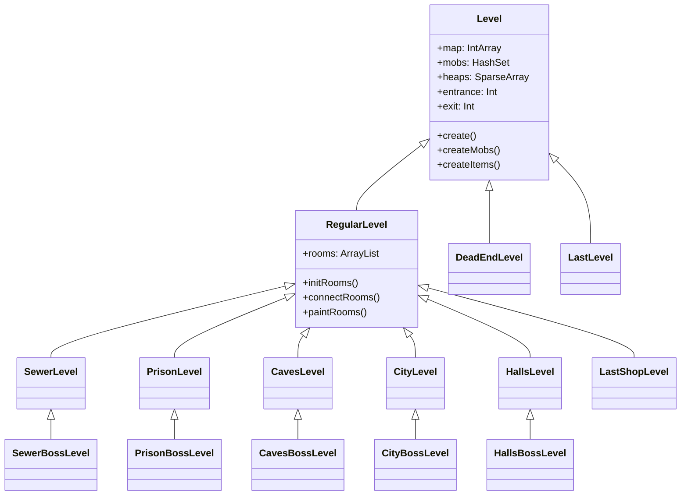
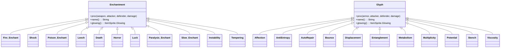

# Class Hierarchy Diagrams

This document contains Mermaid diagrams showing the inheritance hierarchies of core classes.

## Visual Hierarchy

The scene graph visual hierarchy from base element to renderable objects:

## Sprite Hierarchy

Character and item sprites:

## Actor Hierarchy

Turn-based entity system:

## Item Hierarchy

All game items:

## Level Hierarchy

Dungeon floor types:

## UI Component Hierarchy

User interface elements:

## Blob Hierarchy

Environmental effects:

## Enchantment/Glyph Hierarchy

Equipment modifiers:

## Plant Hierarchy

Dungeon flora:

---

## See Also

- [Architecture Overview](../architecture/overview.md)
- [Scene Flow](scene-flow.md)
- [Game Loop](game-loop.md)
