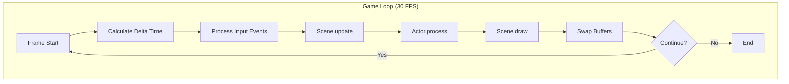
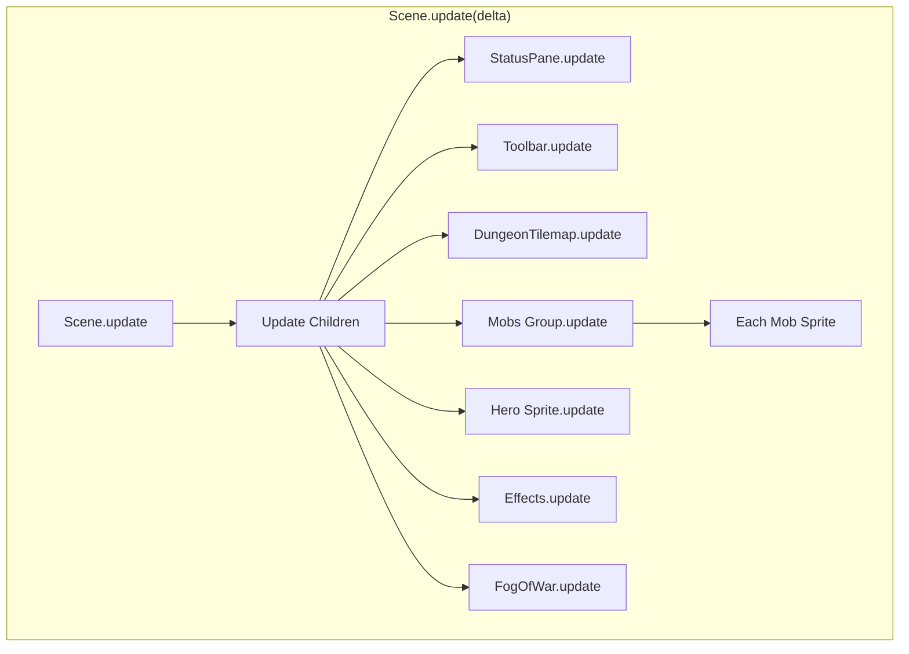
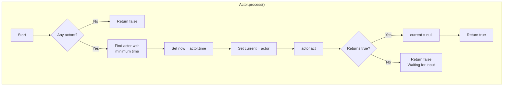
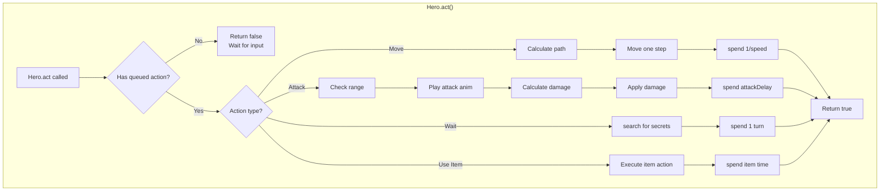
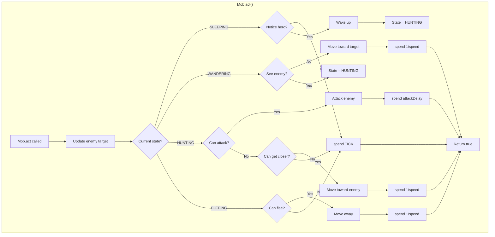
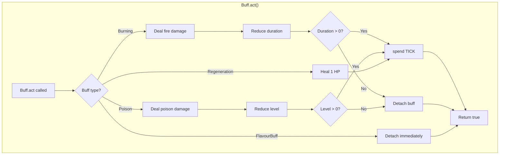
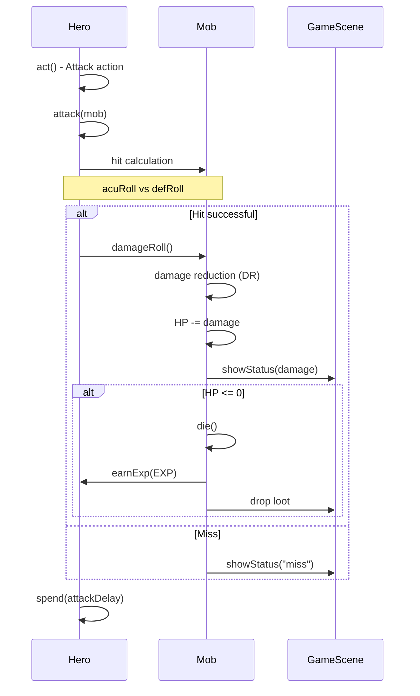
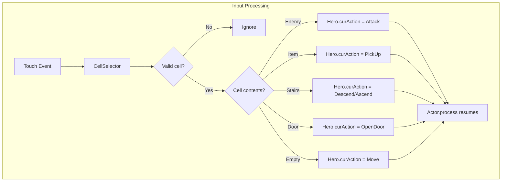
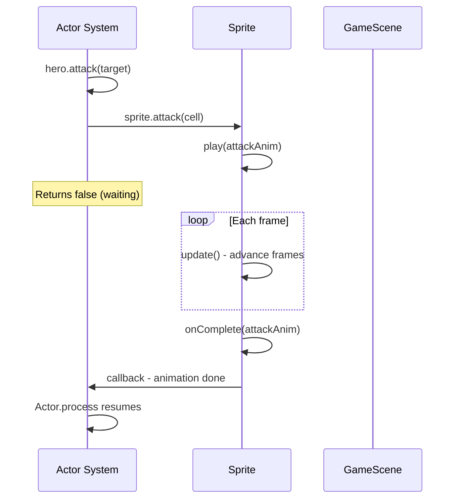

# Game Loop Diagram

This document explains the game loop and turn-based actor system in Amazing Pixel Dungeon.

## Main Game Loop

The game runs at approximately 30 FPS with a fixed timestep:



## Frame Timing

```kotlin
// In Game.kt
class Game {
    companion object {
        const val TICK = 1f / 30f  // ~33ms per frame
    }

    private var lastTime: Long = 0

    fun step() {
        val now = SystemClock.elapsedRealtime()
        val delta = (now - lastTime) / 1000f
        lastTime = now

        // Clamp delta to prevent spiral of death
        val elapsed = min(delta, 0.1f)

        // Update game logic
        scene?.update(elapsed)

        // Process turn-based actors
        if (scene is GameScene) {
            Actor.process()
        }
    }

    fun draw() {
        GLES20.glClear(GLES20.GL_COLOR_BUFFER_BIT)
        camera?.updateMatrix()
        scene?.draw()
    }
}
```

## Scene Update Cascade

The update propagates through the scene graph:



## Actor System

### Turn-Based Processing



### Actor Time Management

```
Time (turns)
│
├─ 0.0  ──► Hero acts
│           spend(1.0) → next turn at 1.0
│
├─ 0.0  ──► Rat acts
│           spend(1.0) → next turn at 1.0
│
├─ 0.5  ──► Buff ticks
│           spend(1.0) → next turn at 1.5
│
├─ 1.0  ──► Hero acts (faster speed)
│           spend(0.5) → next turn at 1.5
│
├─ 1.0  ──► Rat acts
│           spend(1.0) → next turn at 2.0
│
└─ ...
```

### Turn Order Priority Queue

```kotlin
object Actor {
    private val all = HashSet<Actor>()
    var now: Float = 0f

    fun process(): Boolean {
        // Find actor with earliest scheduled time
        var next: Actor? = null
        var minTime = Float.MAX_VALUE

        all.forEach { actor ->
            if (actor.time < minTime) {
                minTime = actor.time
                next = actor
            }
        }

        // Execute that actor's turn
        next?.let { actor ->
            now = actor.time
            current = actor

            if (actor.act()) {
                current = null
                return true  // Turn completed
            } else {
                return false  // Waiting for input
            }
        }

        return false
    }
}
```

## Hero Action Flow

When the hero needs to act:



## Mob AI Flow

Each mob processes its AI state:



## Buff Processing

Buffs act as independent actors:



## Combat Resolution



## Input Handling



## Animation Synchronization



## Frame Budget

Target: 33ms per frame (30 FPS)

```
┌─────────────────────────────────────────────────────┐
│                    Frame (33ms)                      │
├────────────┬──────────────┬─────────────────────────┤
│   Input    │    Update    │         Render          │
│   (~1ms)   │   (~5-10ms)  │       (~15-20ms)        │
├────────────┼──────────────┼─────────────────────────┤
│ Touch      │ Scene.update │ Clear screen            │
│ events     │ Actor.process│ Draw tilemap            │
│ Key        │ Sprite anims │ Draw sprites            │
│ events     │ Particle FX  │ Draw effects            │
│            │ Camera follow│ Draw UI                 │
│            │              │ Swap buffers            │
└────────────┴──────────────┴─────────────────────────┘
```

## Optimization Strategies

### Batch Rendering
```kotlin
// Sprites batched by texture
fun draw() {
    NoosaScript.get()
        .camera(camera)
        .texture(texture)
        .drawQuads(allSpriteVertices)
}
```

### Dirty Flags
```kotlin
// Only update changed tiles
class Tilemap {
    var dirty = BooleanArray(LENGTH)

    fun updateCell(cell: Int) {
        dirty[cell] = true
    }

    fun draw() {
        if (dirty.any { it }) {
            rebuildVertices()
            dirty.fill(false)
        }
        render()
    }
}
```

### Object Pooling
```kotlin
// Reuse particle objects
object ParticlePool {
    private val available = Stack<Particle>()

    fun get(): Particle {
        return if (available.isEmpty()) {
            Particle()
        } else {
            available.pop().reset()
        }
    }

    fun recycle(p: Particle) {
        available.push(p)
    }
}
```

---

## See Also

- [Actor System](../systems/actor-system.md) - Detailed actor documentation
- [Scene System](../systems/scene-system.md) - Scene lifecycle
- [Rendering System](../systems/rendering-system.md) - Graphics pipeline
