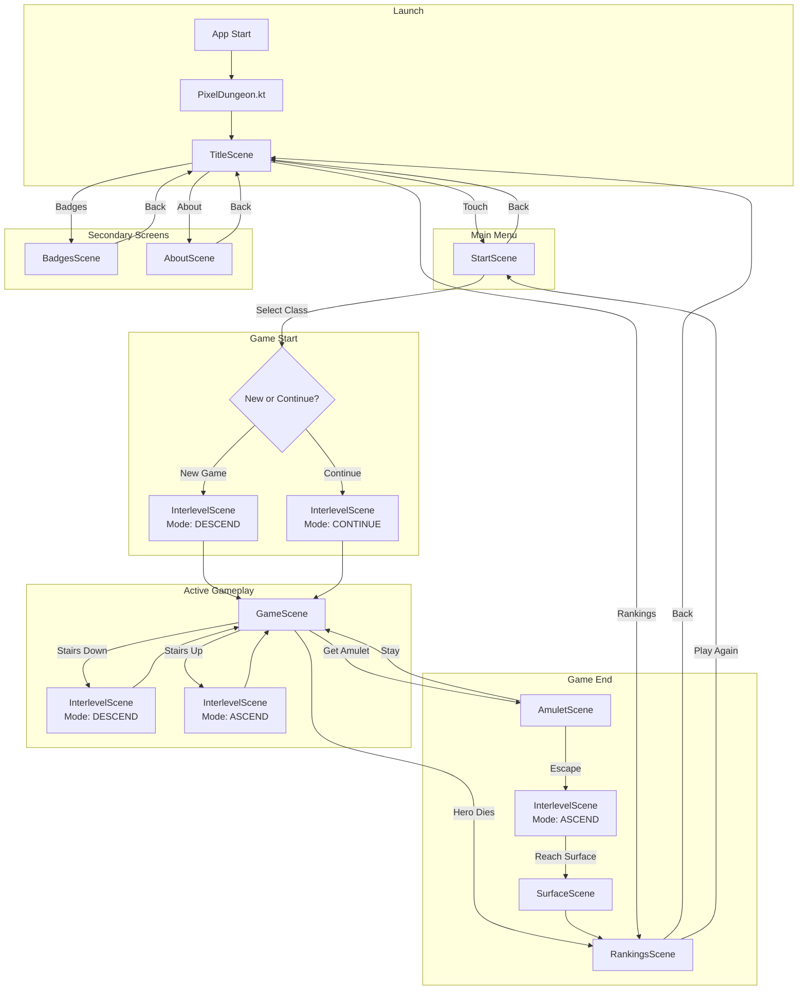

# Scene Flow Diagram

This document shows the flow between scenes in Amazing Pixel Dungeon.

## Main Scene Flow



## Detailed Scene Descriptions

### TitleScene
**Entry point** - Main menu screen

```
┌─────────────────────────────────┐
│                                 │
│     [PIXEL DUNGEON LOGO]        │
│                                 │
│                                 │
│       Touch to Start            │
│                                 │
│                                 │
│    [Badges]  [Rankings]         │
│             [About]             │
│                                 │
│                v1.0.0           │
└─────────────────────────────────┘
```

**Transitions**:
- Touch screen → StartScene
- Badges button → BadgesScene
- Rankings button → RankingsScene
- About button → AboutScene

---

### StartScene
**Character selection** - Choose hero and start game

```
┌─────────────────────────────────┐
│  [Back]           [Challenges]  │
├─────────────────────────────────┤
│                                 │
│  [Warrior]     [Mage]           │
│   ┌─────┐      ┌─────┐          │
│   │     │      │     │          │
│   └─────┘      └─────┘          │
│                                 │
│  [Rogue]       [Huntress]       │
│   ┌─────┐      ┌─────┐          │
│   └─────┘      └─────┘          │
│                                 │
│  ┌─────────────────────────┐    │
│  │  Class Description      │    │
│  │  Starting Equipment     │    │
│  └─────────────────────────┘    │
│                                 │
│        [START GAME]             │
└─────────────────────────────────┘
```

**Transitions**:
- Back → TitleScene
- Select class + Start → InterlevelScene (DESCEND)
- Continue game → InterlevelScene (CONTINUE)

---

### InterlevelScene
**Loading/transition** - Level generation and loading

```
┌─────────────────────────────────┐
│                                 │
│                                 │
│                                 │
│         Descending...           │
│         ═══════════             │
│             ░░░░░               │
│                                 │
│                                 │
│                                 │
└─────────────────────────────────┘
```

**Modes**:
| Mode | Trigger | Action |
|------|---------|--------|
| DESCEND | Stairs down | Generate new level |
| ASCEND | Stairs up | Load previous level |
| CONTINUE | Load game | Restore saved state |
| RESURRECT | Ankh use | Respawn hero |
| RETURN | Lloyd's Beacon | Return to marked spot |
| FALL | Chasm | Generate level + fall damage |

**Transitions**:
- Loading complete → GameScene

---

### GameScene
**Main gameplay** - Dungeon exploration and combat

```
┌─────────────────────────────────┐
│ [HP Bar] [Buffs]    Gold: 150   │
├─────────────────────────────────┤
│  ░░░░░░░░░░░░░░░░░░░░░░░░░░░░  │
│  ░░░░░▓▓▓▓░░░░░░▓▓▓▓░░░░░░░░░  │
│  ░░░░░▓  ▓░░░░░░▓  ▓░░░░░░░░░  │
│  ░░░░░▓  ▓▓▓▓▓▓▓▓  ▓░░░░░░░░░  │
│  ░░░░░▓        @   ▓░░░░░░░░░  │
│  ░░░░░▓  ▓▓▓▓▓▓▓▓  ▓░░░░░░░░░  │
│  ░░░░░▓  ▓░░░░░░▓  ▓░░░░░░░░░  │
│  ░░░░░▓▓▓▓░░░░░░▓▓▓▓░░░░░░░░░  │
│  ░░░░░░░░░░░░░░░░░░░░░░░░░░░░  │
├─────────────────────────────────┤
│  Combat Log                     │
├─────────────────────────────────┤
│ [Wait] [Search] [Bag] [Quick]   │
└─────────────────────────────────┘
```

**Windows** (modal overlays):
- WndBag - Inventory
- WndItem - Item details
- WndHero - Character sheet
- WndSettings - Game settings
- WndGame - Pause menu

**Transitions**:
- Stairs down → InterlevelScene (DESCEND)
- Stairs up → InterlevelScene (ASCEND)
- Hero death → RankingsScene
- Get Amulet → AmuletScene

---

### AmuletScene
**Victory choice** - Decision after obtaining Amulet

```
┌─────────────────────────────────┐
│                                 │
│    You finally hold the         │
│    Amulet of Yendor!            │
│                                 │
│    [Image of Amulet]            │
│                                 │
│    What will you do?            │
│                                 │
│    ┌─────────────────────┐      │
│    │  Escape to Surface  │      │
│    └─────────────────────┘      │
│                                 │
│    ┌─────────────────────┐      │
│    │  Stay and Explore   │      │
│    └─────────────────────┘      │
│                                 │
└─────────────────────────────────┘
```

**Transitions**:
- Escape → InterlevelScene (ASCEND chain) → SurfaceScene
- Stay → GameScene (continue playing)

---

### SurfaceScene
**Victory screen** - Successful escape

```
┌─────────────────────────────────┐
│                                 │
│    ☀️  The sun rises...          │
│                                 │
│    [Animated scene of hero      │
│     walking toward sunset]      │
│                                 │
│    You escaped the dungeon      │
│    with the Amulet of Yendor!   │
│                                 │
│    Final Score: 125,000         │
│                                 │
│    ┌─────────────────────┐      │
│    │  Continue           │      │
│    └─────────────────────┘      │
│                                 │
└─────────────────────────────────┘
```

**Transitions**:
- Continue → RankingsScene

---

### RankingsScene
**High scores** - Leaderboard display

```
┌─────────────────────────────────┐
│  [Back]         Rankings        │
├─────────────────────────────────┤
│                                 │
│  #1  125,000  Warrior  Victory  │
│  #2   98,500  Mage     Floor 24 │
│  #3   76,200  Rogue    Floor 20 │
│  #4   54,100  Huntress Floor 15 │
│  #5   32,400  Warrior  Floor 10 │
│  #6   21,300  Mage     Floor 8  │
│  #7   15,200  Rogue    Floor 6  │
│  #8    9,800  Warrior  Floor 4  │
│  #9    5,400  Huntress Floor 3  │
│  #10   2,100  Mage     Floor 1  │
│                                 │
│                                 │
│        [Play Again]             │
└─────────────────────────────────┘
```

**Transitions**:
- Back → TitleScene
- Play Again → StartScene

---

### BadgesScene
**Achievements** - Badge collection display

```
┌─────────────────────────────────┐
│  [Back]          Badges         │
├─────────────────────────────────┤
│                                 │
│  [🏆] [🏆] [🔒] [🔒] [🔒] [🔒]  │
│                                 │
│  [🏆] [🔒] [🔒] [🔒] [🔒] [🔒]  │
│                                 │
│  [🔒] [🔒] [🔒] [🔒] [🔒] [🔒]  │
│                                 │
│  ┌─────────────────────────┐    │
│  │  First Blood            │    │
│  │  Kill 10 enemies        │    │
│  │  [Unlocked]             │    │
│  └─────────────────────────┘    │
│                                 │
└─────────────────────────────────┘
```

**Transitions**:
- Back → TitleScene
- Select badge → WndBadge (info popup)

---

### AboutScene
**Credits** - Game information

```
┌─────────────────────────────────┐
│  [Back]           About         │
├─────────────────────────────────┤
│                                 │
│    Amazing Pixel Dungeon        │
│    Version 1.0.0                │
│                                 │
│    Based on Pixel Dungeon       │
│    by Watabou                   │
│                                 │
│    ─────────────────────        │
│                                 │
│    Code & samples:              │
│    [Links]                      │
│                                 │
│    Graphics:                    │
│    [Credits]                    │
│                                 │
│    Music:                       │
│    [Credits]                    │
│                                 │
└─────────────────────────────────┘
```

**Transitions**:
- Back → TitleScene

---

## State Machine Summary

```
                                    ┌──────────┐
                         ┌─────────►│  About   │
                         │          └──────────┘
                         │
┌────────┐    ┌─────────┴───┐    ┌──────────┐
│ Launch │───►│   Title     │───►│  Badges  │
└────────┘    └──────┬──────┘    └──────────┘
                     │
                     ▼
              ┌─────────────┐
              │    Start    │◄──────────────┐
              └──────┬──────┘               │
                     │                      │
                     ▼                      │
              ┌─────────────┐               │
              │ Interlevel  │◄───────┐      │
              └──────┬──────┘        │      │
                     │               │      │
                     ▼               │      │
              ┌─────────────┐        │      │
         ┌───►│    Game     │────────┘      │
         │    └─┬─────────┬─┘               │
         │      │         │                 │
         │      ▼         ▼                 │
         │ ┌────────┐ ┌────────┐            │
         └─┤ Amulet │ │Rankings│────────────┘
           └────────┘ └────────┘
                │          ▲
                ▼          │
           ┌────────┐      │
           │Surface │──────┘
           └────────┘
```

---

## See Also

- [Scene System](../systems/scene-system.md) - Detailed scene implementation
- [Class Hierarchy](class-hierarchy.md) - Scene class hierarchy
- [Game Loop](game-loop.md) - Frame update cycle
